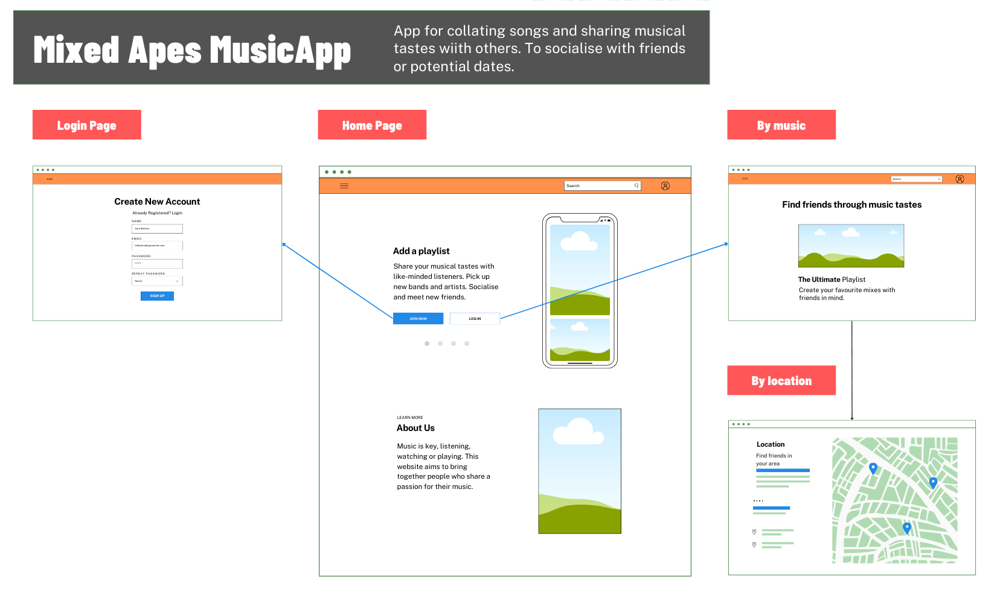
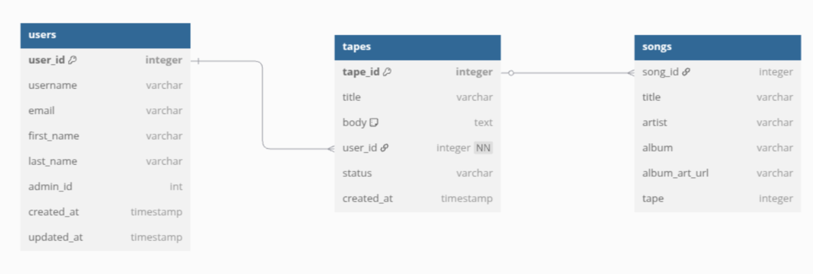

# Mixed-Apes
A place to share mix tapes of favourite playlists.

## Learning Outcomes

**LO1 apply Agile Methodology in Planning and Designing a Django Web Framework** 

1. Front-End Design

*I created the app based on an existing template for a site that I have a mock up site for online. I didn't spend a lot of time on wireframes as I wanted my site to look as closely as possible to the online mockup site on www.mixedapes.com.* 

## Wireframe

*In the end, this would have been too much of an undertaking for this project. I believe the site meets the MVP for the main point of the site which is to create playlists and discover other's tastes. I believe the app could be continued after the assessment to improve the social app idea.*

*I used the [Lighthouse Accessibility checker][2] and acheived 100% for accessibility standards and in the 90s for the other criteria.*

2. Database

## Entity Relationship Diagram

3. Agile Methodology

*Here is a copy of the [Kanban board][1] project I created, though I did in fact use notes in my notebook and pen and paper more than this. This is an area I need to work on.*

4. Code Quality

*I used the online W3C code validator to check the code quality and received [no errors or warnings][3].*

5. Documentation

*I created daily lists of what I needed to do in my notebook, I knew that later I would need to update these into my repository's README.md which is this document.*

[🔼 Back to top](#mixed-apes)

---

**LO2 Develop and Implement a data model, application features and business logic to manage data in a real-world domain**

1. Database Development

*With the help of Co-Pilot I created the models based on the ERD I had designed.*

2. CRUD functionality

*The CRUD functionality of my app is that registered users can Create tapes, Read tapes of theirs and other users, Update their own tapes and Delete their own tapes.*

*When they have created a tape, or tapes, users can Create, Read, Update and Delete songs on that tape.*

3. User notifications

*The user gets notification by the tape being added to the list of tapes, songs get added to the list of songs. If a song is added that is recognised by the Spotify API I wrote then the song's album cover also appears next to the song title and artist.*

*If a user tries to delete an entire tape then a confirmation page appears to check that this is the desired action.*

4. Form validation

*I relied on Django "Crispy Forms" for form controls, as I wanted more control over the look of the controls. However my stylesheet somehow crashed at the 11th hour and I lost a lot of the presentation side of the form but I thought it was more important to keep the functionality.*

[🔼 Back to top](#mixed-apes)

---

**LO3 Authorisation and Authentication Permissions**

1. Role-based Login and Registration

*A user has to login in order to obtain CRUD permissions and still then the user can only manage their own tapes and songs.*

2. Reflect login state

*A registration and login link is shown in the top right of the page until logged in whereupon it changes to a greeting and the users name.*

3. Access control

*The database also has a super user account and under the sites admin area this super user can add or delete any songs or tapes, and can even manage users should the need arise.*

[🔼 Back to top](#mixed-apes)

---

**LO4 Design, Create and Execute Manual or Automated tests**

1. Python tests procedures

[Manual testing table below](#Manual-Testing)

2. Javascript test procedures

[Manual testing table below](#Manual-Testing)

3. Testing documentation

[Manual testing table below](#Manual-Testing)

[🔼 Back to top](#mixed-apes)

---

**LO5 Version control and Repository Hosting**

1. Version control with Git and GitHub

*Regular commits were made to this GitHub repository and to Heroku.*

2. Secure code management

*Any environment variables, passwords or other sensitive information was kept in file(s) which were labelled under gitignore*

[🔼 Back to top](#mixed-apes)

---

**LO6 Deploy to cloud based platform**

1. Deploy to a Cloud-based platform

*Deployed to Heroku using a PostGres SQL database and with sensitive information stored as environment variables.
This includes the database connection string and the SECRET KEY and TOKEN for the Spotify API.*

2. Document the deployment process

*Created a new application on Heroku, linked it to the relevant GitHub repository and added the Database connection string into
an an environment variable. Then deployed from the "main" branch. Took some time to build but once it had needed to do some testing
to check that everything was configured correctly. There were some errors at first which I needed to consult the logs for, but these turned out to be differences in the settings file for remote and local deployment. Once I had solved these errors the app was
deployed and I could carry out testing on it.*

3. Ensure the security in deployment: No sensitive data, no Passwords and Debug set to False

*No sensitive data was sent to the remote server and Debug was set to False on the live site.*

[🔼 Back to top](#mixed-apes)

---

**LO7 Design and Implement custom data models**

1. Design and Implement a custom data model

*I created a custom model of the mixtape and its related songs, This was based on the real-world model of a person create a mixtape for friends, family or potential partner. The idea is that the playlist would be themed and songs added to each specific tape for other people to give feedback on.*

*I created the Spotify API app that works with the name of the song and the name of the artist to return a copy of album cover that the song comes from. The album cover art URL is stored in the database*  

[🔼 Back to top](#mixed-apes)

---

**LO8 Leverage AI tools to orchestrate the software Development Phase**

1. Use AI tools to assist in code creation

*I used Co-Pilot to help with the initial creation of the apps, I then had to re-configure or amend code that was not relevant.*

2. Use AI tools to assist in debugging code

*Co-Pilot was very useful at times for pointing out errors in code, and even how to fix the code. However, sometimes it did repeat
the same information if the code it supplied the first time didn't solve an error. This made for asking more direct questions or pointing out that certain code snippets didn't work and to ask for a different solution.*

3. Use AI tools to optimise code for performance and user experience.

*I used the online W3C online checker to make sure the code was fully optimised.*

4. Use AI tools to create automated tests

*I used the lighthouse Developer tools on Chrome to check the site's compliance to accessibility and speed.*

5. Reflect on AI's role in the development process and impact on workflow.

*On the whole I found AI (Co-Pilot) to be helpful for debugging as most of the time it would find the broken code and give an example of how to fix it. However, at times I found myself to become to reliant on using Co-Pilot as it was supplying code that could have broken other areas of the site. I believe if you check the AI code through then you can save a lot of time debugging or searching online for an answer.*

[🔼 Back to top](#mixed-apes)

---

## Manual-Testing

### Feature Testing

|Page|Feature|Action|Effect|
|---|---|---|---|
|Header|Site Logo|Click|Redirects to home page from all pages|
|Header|Logged In User Display|Log in as existing user|Username appears in navbar|
|Header|Login link|Click|Redirects to Sign In Page|
|Header|Register link|Click|Redirects to Sign Up Page|
|Header|Logout link|Click|Redirects to home page with user signed out|

|Homepage|All Loops Button|Click|All loops displayed on homepage|
|Homepage|My Loops Button|Not logged in|Button is disabled|
|Homepage|My Loops Button|Logged in : click|Only user's loops are displayed|
|Homepage|Edit Button|Logged out|Not visible|
|Homepage|Edit Button|Logged in : click|Visible - redirects to Loop Editor Page|
|Homepage|Loop row|Hover on row|Row is highlighted in green|
|Homepage|Loop row|Click|Redirects to Loop Detail Page for this selected loop|
|Homepage|Call-to-Action New Loop Button|Logged in : click|Redirects to Create New Loop Form|
|Homepage|Call-to-Action login button|Logged out : click|Redirects to Login Page|
|Homepage|Message on login|Login as user|Successful Signin message appears, clears after 3 seconds|
|Homepage|Message on logout|Logout|Successful signout message appears, clears after 3 seconds|
|Login Page|Social sign-in button|Click|Redirects to confirm social signin page|
|Login Page|Social sign-in continue button|Click|Redirects to Sign in with Google page|
|Login Page|Username validation|Enter incorrect username|Error message response - does not specify if username or password failed|
|Login Page|Password validation|Enter incorrect password|Error message response - does not specify if username or password failed|
|Login Page|Remember me button|Checkbox on|Close browser window and reopen - user still logged in|
|Login Page|Sign in button|Click|Redirects to home page, shows successful login message|
|Logout Confirm Page|Sign Out button|Click|Redirects to home page, user logged out|
|Register Page|Reroute to login page|Click link|Redirects to login page|
|Register Page|Username validation|Try using existing username|Error message appears - 'A user with that username already exists'|
|Register Page|email validation|Entered invalid email (without '@'|Error message - 'Please enter valid email address' and registration fails|
|Register Page|password1|Enter a short password|Error message - 'That password is too short'|
|Register Page|password2|Enter different password to password1 field|Error message - 'You must type the same password each time'|
|Register Page|Sign Up button|Entered valid form data|Redirects to home page - success message displayed|
|Loop Detail Page|Loop name display|No action|Loop name displays correctly|
|Loop Detail Page|Creator display|No action|Creator name displays correctly|
|Loop Detail Page|Track beat display|No action|All tracks present, all beats present|
|Loop Detail Page|Track beat animation|Click play button|Each beat highlighted in time on each track|
|Loop Detail Page|Site logo animation|Click play button|Logo grows on every 16th beat, and then slowly shrinks|
|Loop Detail Page|Play button|Click|Audio playback and animations begin|
|Loop Detail Page|Play button|Hover|Button appearance changes|
|Loop Detail Page|Pause button|Click|Audio playback and animations cease|
|Loop Detail Page|Play/pause button animation|Click to play|Button icon rotates quickly at beginning of every 16th beat|
|Loop Detail Page|Volume Input|Click on up and down buttons on input|Volume immediately goes up and down|
|Loop Detail Page|Share link display|No action|current url displayed|
|Loop Detail Page|Share link copy button|Click|link successfully copied to clipboard|
|Loop Detail Page|Rating button|Click|Redirects to rating page|
|Loop Detail Page|Rating button when logged out|No action|Not shown|
|Loop Editor Page|Loop name display|No action|Loop name displayed correctly|
|Loop Editor Page|Creator display|No action|Creator name displayed correctly|
|Loop Editor Page|Tempo control|Click arrow buttons to increase and decrease value|Tempo increases and decreases immediately as audio plays|
|Loop Editor Page|Instrument button|Click|Instrument modal shown, current instrument highlighted|
|Loop Editor Page|Instrument modal|Click on option|Sample plays once|
|Loop Editor Page|Instrument modal dismiss|Click outside modal or close button|Modal is hidden|
|Loop Editor Page|Instrument modal save button|Save clicked|Modal hidden, instrument updated|
|Loop Editor Page|Instrument change message|No action|Instrument changed message shown, fades after 3 sec|
|Loop Editor Page|Track volume control|Adjust slider|Volume of track changes in real time|
|Loop Editor Page|Beat toggle|Toggle on|Beat is now heard in playback, beat div highlighted|
|Loop Editor Page|Delete track button|Click|Confirm delete track modal shown|
|Loop Editor Page|Confirm delete track|Click|Track deleted and confirmation message shown|
|Loop Editor Page|Refuse delete track|Click|No change to loop|
|Loop Editor Page|Play button|Click|Audio playback and animations begin, icon changes to pause|
|Loop Editor Page|Pause button|Click|Audio playback and animations end, icon changes to play|
|Loop Editor Page|Loop volume control|Click on up and down arrow buttons|Overall playback volume increases and decreases|
|Loop Editor Page|Add new track button|Click|Instrument modal shown, after save clicked, new track appears with chosen instrument|
|Loop Editor Page|Delete Loop Button|Click|Confirm delete loop modal appears|
|Loop Editor Page|Delete Loop confirm|Click|Redirects to homepage, success message displayed, loop gone|
|Loop Editor Page|Delete loop reject|Click|No change to loop|
|New Loop Form|Name field|No action|Default name shown|
|New Loop Form|Tempo field|Click on arrow buttons|Tempo increases and decreases|
|New Loop Form|Let's get looping button|Click|Redirects to Loop Editor page, success message displayed|
|New Loop Creation Flow|Default set-up|Create new loop|New loop created with one track, default instrument selected, no beats yet selected|
|New Loop Creation Flow|Error|Enter name that already exists|Form displayed again with error shown|
|Loop Rating page|Previous comment|No action|Previous comments shown correctly|
|Loop Rating page|Previous rating|No action|Previous ratings shown correctly|
|Loop Rating page|Previous reviewer|No action|Previous reviewer shown correctly|
|Loop Rating page|User rating selector|Click on up and down arrows|Rating ranges from 0 to 5|
|Loop Rating page|User rating validation|Click to increase from 5 to 6|No change and red error highlight appears|
|Loop Rating page|User comment field|Fill with text|Text appears, comment max length observed|
|Loop Rating page|Submit button|Click|Redirects to home page, success message appears|

---

[1]: https://github.com/users/Olbotron/projects/7
[2]: https://github.com/Olbotron/mixedapes/blob/main/static/images/lighthouse-check.png
[3]: https://github.com/Olbotron/mixedapes/blob/main/static/images/HTML-checker.png